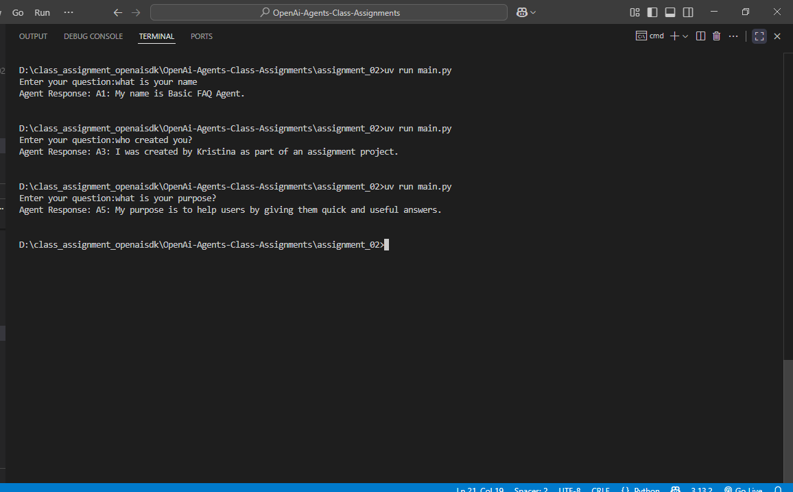

# OpenAISDK Class Assignments

## Assignment 2: Basic FAQ Agent

### Objective: 
- Create a simple chatbot agent that answers a set of predefined questions (like “What is your name?”, “What can you do?”).

## Tasks:
- Use the OpenAI Agent SDK to create an agent.
- Add a simple prompt or context about the agent (e.g., “You are a helpful FAQ bot.”).
- Run the agent and test it with at least five different questions and document the answers.
- Deliverable: Python file with agent code, screenshots of interactions.

## Screenshot:
